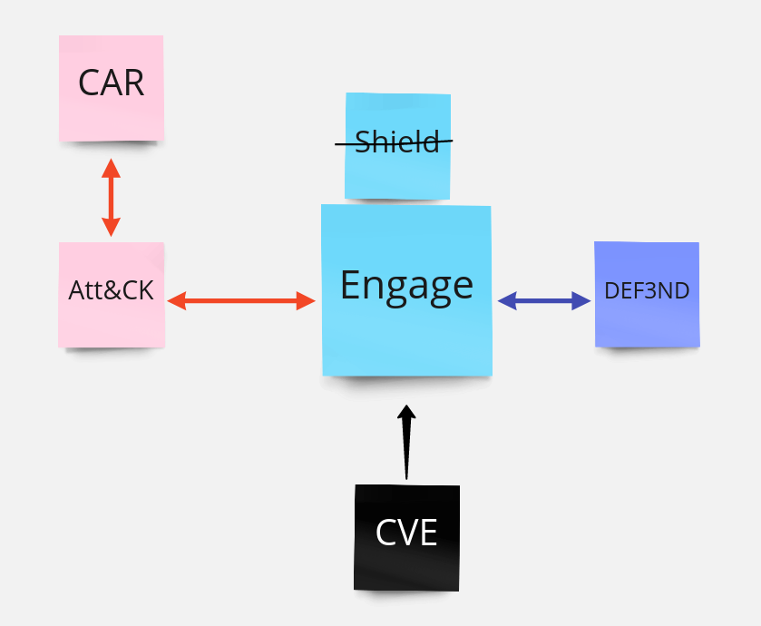
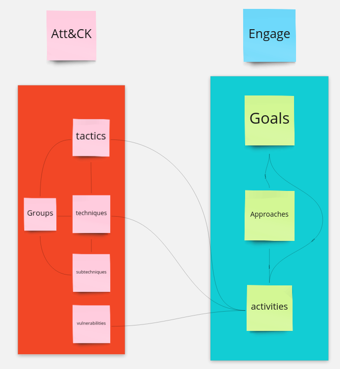

```{r setup, include=FALSE}
list.of.packages <- c("igraph","networkD3","dm","collapsibleTree","ggplot2")
new.packages <- list.of.packages[!(list.of.packages %in% installed.packages()[,"Package"])]

if(length(new.packages)) {
  install.packages(new.packages)
} else {
  print("[info] No new packages are required.")
}

knitr::opts_chunk$set(echo = TRUE)

library(jsonlite, warn.conflicts = FALSE)
library("networkD3")
library("plyr")
library("dplyr")
library("stringr")
library("collapsibleTree")
library("ggplot2")

rm(list.of.packages, new.packages)

```

## Objetivo
El objetivo de este estudio es entender qué es MITRE ENGAGE, como se relaciona con otros estándares de MITRE y como puede ser útil para una organización.
Se estudiaran los datos oficiales proporcionados por la asociación MITRE en su [repositorio de github](https://github.com/mitre/engage), muy en detalle la información proporcionada en [_data](https://github.com/mitre/engage/tree/main/_data) poniéndo especial émfasis en ENGAGE no tanto en su relación con attack.

```{r rawdata, echo=FALSE}
rootpath <- "data/engage"

if (!dir.exists("data")) dir.create("data")
if (!dir.exists(rootpath)) dir.create(rootpath)

# Download and apply simple parser to raw data
req <- httr::GET("https://api.github.com/repos/mitre/engage/git/trees/main?recursive=1")
httr::stop_for_status(req)
filelist <- unlist(lapply(httr::content(req)$tree, "[", "path"), use.names = F)
filepath <- sapply(sapply(strsplit(grep("_data.*.json", filelist, value = T), "/"),
                          function(x) x[2]),
                   function(x)
                     paste0("https://raw.githubusercontent.com/mitre/engage/main/_data/",x))
filelist <- names(filepath)

engage <- list()
for (i in 1:length(filelist)) {
  n <- filelist[i]
  if (!file.exists(paste0(rootpath, "/", n))) {
    download.file(url = filepath[i],
                  destfile = paste0(rootpath, "/", n), quiet = TRUE)
  }
  engage[[n]] <- fromJSON(paste0(rootpath, "/", n))
}

rm(req, filelist, filepath, i, n, rootpath)
```

```{r clean_data, echo=FALSE}
# Goals
df_goals  <- as.data.frame(engage$goals.json)
goal_details <- engage$goal_details.json 

# Activities
df_activities  <- as.data.frame(engage$activities.json)
df_activities <- df_activities[, c("id","name","description","long_description")]
activity_details  <- engage$activity_details.json

# Approaches
df_approaches  <- as.data.frame(engage$approaches.json)
approach_details  <- engage$approach_details.json

# Relations
approach_activity_mappings  <- engage$approach_activity_mappings.json
goal_approach_mappings  <- engage$goal_approach_mappings.json

# Attack
#attack_tactics_techniques  <- engage$attack_tactics_techniques.json
#attack_groups  <- engage$attack_groups.json
df_attack_mapping  <- engage$attack_mapping.json
#attack_groups_mapped  <- engage$attack_groups_mapped.json

#navigation  <- engage$navigation.json

rm(engage)
```

## Introducción

MITRE ENGAGE es un framework para planificar y discutir como enfrentar o "engañar" a los enemigos y el bloqueo de sus actividades. Se nutre de comportamientos de enemigos observados en el mundo real y pretende impulsar resultados estratégicos de cyberseguridad.

ENGAGE es el reemplazo de MITRE Shield. Basándose en elfeedback recibido por la comunidad, MITRE ha decidido substituir la antigua Shield (una base de conocimiento) simplificandola y centrándose en las áreas de bloqueo, engaño y enfrentamiento del adversario.  

#### ENGAGE desde el punto de vista del blue team

MITRE ENGAGE ofrece una aproximación organizada, procedimentada y estratégica para pasar de objetivos de prevención o para entender la información de un atacante a planes y a técnicas concretas. En resumen es un framework que ayudará a cualquier blue team a impulsar sus estrategias de Defensa Activa.

A diferencia de SHIELD ofrece las "Adversary Vulnerabilities" que permite a los defensores centrarse en los eslabones más débiles de la seguridad. 


#### ENGAGE desde el punto de vista del red team

MITRE ENGAGE es una buena base para planificar tácticas de ofuscación sabiendo, de antemano, las acciones específicas que hará la víctima. Por otro lado también ofrece información sobre ataques con impacto y los grupos que los han perpetrado (sin llegar a dar datos específicos).

#### Relaciones con otros frameworks

ENGAGE se nutre de información del mundo real para determinar objetivos, aproximaciones y actividades que de forma proactiva ayuden a las organizaciones a protegerse de ataques. La información de estos ataques se puede vincular con el framework ATT&CK, de la propia MITRE, también. Siendo  capaz de vincular tecnicas, tácticas y vulnerabiliades con las propuestas estrategicas de solución ofrecidas por ENGAGE. 

```{r relaciones_externas, echo=FALSE}


```





### Data frames elegantes

```{r tidy_data, echo=FALSE}

#df_goals
df_goals$type <- laply(df_goals[["id"]], function(x) goal_details[[x]]$type)
#rm(goal_details)

#df_approaches
df_approaches$type <- laply(df_approaches[["id"]], function(x) approach_details[[x]]$type)
#rm(approach_details)

#df_activites (TO DO, if necessary)
# df_activities 


#relations
#goals, approachs and activitiesinst
goal_approach_activity_mapping <-  ldply(names(approach_details), function(approach) ldply(approach_details[[approach]]$activities, function(activities) c(
    goal=goal_details[[approach_details[[approach]]$goals]]$name,
    approach=approach_details[[approach]]$name,
    activity=activity_details[[activities]]$name)))

## Activities and vulns mapping
activities_with_vulns <- names(activity_details)[which(sapply(activity_details, function(x) !!length(x$vulnerabilities)))]
vulns_activity_mapping <- llply (activities_with_vulns, function(activity_id) llply(activity_details[[activity_id]]$vulnerabilities$id, function(vuln_id) vuln_id))
names(vulns_activity_mapping) <- activities_with_vulns
df_activities_vulns_mapping <- ldply(activities_with_vulns, function(activity) ldply(vulns_activity_mapping[[activity]], function(x) c(activity=activity,vulnerability=x)))


# Activities and techniques mapping
activities_with_techniques <- names(activity_details)[which(sapply(activity_details, function(x) !!length(x$attack_techniques)))]
techniques_activity_mapping <- llply (activities_with_techniques, function(activity_id) llply(activity_details[[activity_id]]$attack_techniques$id, function(technique_id) technique_id))
names(techniques_activity_mapping) <- activities_with_techniques
df_activities_techniques_mapping <- ldply(activities_with_techniques, function(activity) ldply(techniques_activity_mapping[[activity]], function(x) c(activity=activity,technique=x)))


# Attack mapping numeric, to work with numeric plots
attack_mapping_numeric <- select(df_attack_mapping, attack_id, eac_id)

attack_mapping_numeric <-  select(attack_mapping_numeric, attack_id, eac_id) %>%
        mutate (attack_id = as.numeric(substring(attack_id,2,5)))

attack_mapping_numeric <-  select(attack_mapping_numeric, attack_id, eac_id) %>%
        mutate (eac_id = as.numeric(substring(eac_id,4,7)))


rm(activities_with_vulns, vulns_activity_mapping, activities_with_techniques, techniques_activity_mapping)
```

### Elementos principales y arquitectura

ENGAGE es un framework que trabaja a 3 niveles distintos, a nivel de "goals", de "approach" y de "activities". Cada uno de estos niveles es un nivel de abstracción distinto (entraremos en mas detalle en los siguientes apartados).

Podemos ver como se relacionan los distintos elementos de los distintos niveles de abstracción (empezando por los objetivos (goals), las aproximaciones (approaches) y finalmente las actividades (activities)).

```{r hierarcy, echo=FALSE}
p <- collapsibleTree( goal_approach_activity_mapping, c("goal", "approach", "activity"),root="ENGAGE summary",tooltip=TRUE)
p
```

### Objetivos (Goals)

 Los objetivos son la necesidad a alto nivel que la organización persigue. En otras palabras, el primer paso para cualquier definición de operación de enfrentamiento al enemigo.
Todas las actividades derivadas que podemos encontrar en engage ayudan a la organización a conseguir cada uno de estos objetivos a alto nivel.
 

```{r Goals_summary, echo=FALSE}

df_goals_clean <- cbind(df_goals[!names(df_goals) %in% "long_description" ])
knitr::kable(df_goals_clean, caption = "Goals table", escape=TRUE)

```

Los Goals, como se puede observar en la tabla, se separan en "estratégicos" y de "enfrentamiento".
Los goals estrategicos ayudan a enfocarse en los espasos para completar antes, durante y después de una operación para asegurar que las actividades estan alineadas con la estrategia global.
Los goals de enfrentamiento, ayudan a las organizaciones a identificar que acciones pueden tomarse en contra de enemigos y ayudan a progresar hacia reducir el impacto de un posible ataque.

```{r Goals_type, echo=FALSE}

pie(c(sum(str_count(df_goals_clean$id,"EG")),sum(str_count(df_goals_clean$id,"SG"))),labels = c("Engagement","Strategic"))

```

### Aproximaciones (Approaches)

Las aproximaciones son los planes en los que avanzar para conseguir los objetivos a alto nivel presentados en el apartado anterior.

Las Aproximaciones de ENGAGE ayudan a las organizaciones a identificar, priorizar y a organizar acciones específicas a tomar en contra de los enemigos.


```{r Approaches, echo=FALSE}
df_approaches_clean <- cbind(df_approaches[!names(df_activities) %in% "long_description" ])
knitr::kable(df_approaches_clean, caption = "Approaches table")
```

Como en el caso de los objetivos, tambien podemos separar las aproximaciones en estratégicas y de enfrentamiento.
Las aproximaciones estratégicas ayudan a alinear cada actividad con la estrategia global.
las aproximaciones de enfrentamiento ayudan a identificar qué acciones puede tomar la organización en contra de un enemigo y para reducir su impacto.

```{r Approaches_depth, echo=FALSE}
pie(c(sum(str_count(df_approaches_clean$id,"EAP")),sum(str_count(df_approaches_clean$id,"SAP"))),labels = c("Engagement","Strategic"))

```

### Actividades (Activities)

Las actividades son las técnicas específicas que las organizaciones emplean para conseguir los objetivos a alto nivel.
Al ser mas específicas tenemos un número significativamente mayor, comparandolos con las técnicas y los objetivos.

```{r Activities, echo=FALSE}
df_activities_clean <- cbind(df_activities[!names(df_activities) %in% "long_description" ])
knitr::kable(df_activities_clean, caption = "Activities table")
```

Como en el caso de las aproximaciones, tambien podemos separar las actividades en estratégicas y de enfrentamiento.
Las actividades estratégicas ayudan a alinear cada acción específica con los objetivos y la estrategia global.
Las actividades de enfrentamiento pueden ser ejecutadas por la organización en contra de un enemigo y para reducir el impacto de dicho enemigo.

```{r Activities_details, echo=FALSE}
pie(c(sum(str_count(df_activities_clean$id,"EAC")),sum(str_count(df_activities_clean$id,"SAC"))),labels = c("Engagement","Strategic"))

```

### Relaciones con otros frameworks
Como podemos ver al inicio de este informe, ENGAGE se relaciona con otros estándares como la base de conocimiento CVE y con los frameworks ATT&CK y DEF3ND.
Vamos a centrarnos en la exploración de su relación con ATT&CK.

#### MITRE ATT&CK 

ATT&CK es una base de conocimiento de tácticas y técnicas que utilizan (o pueden utiizar) cyberenemigos, basada en la observación de situaciones reales. Se utiliza como base para desarrollar modelos de amenaza y metodologias en productos y serivicios de cyberseguridad. Por este motivo es de principal relevancia identificar que relación existen entre las actividades propuestas por ENGAGE y los riesgos (tácticas y técnicas) recopiladas por ATT&CK.

Para este informe es necesario saber que ATT&CK organiza su base de conocimiento en tipologías de tácticas (empresa, mobile) (unas 14 para cada tipología) y que dentro de estas tácticas (que representan el "porqué" de una técnica o conjunto de técnicas y subtecnicas, o en otras palabras:"qué quiere conseguir un enemigo".)
Las técnicas (que existen muchísimas mas que técnicas) son el "cómo" un enemigo espera conseguir resultados en una táctica específica.

Por ejemplo; una táctica podría ser "Conseguir acceso privilegiado" y una técnica podría ser "hacer un dump de credenciales de otros usuarios".


#### Relación a bajo nivel con Att&ck

El objetivo de ENGAGE es proporcionar un framework transversal de alto a bajo nivel de defensa activa. MITRE proporciona información sobre threat modeling via Att&ck, por lo tanto no es de extrañar que existe una fuerte relación entre los dos frameworks.

En la siguiente imágen podemos ver el mapeo a bajo nivel entre actividades de Engage y elementos de Att&ck.



Por los motivos anteriormente comentados vamos a centrarnos en la relación entre las actividades de ENGAGE y y las técnicas de ataque de ATT&CK (sin entrar al detalle de que subtécnicas específicas se estan mitigando).

Para tratar la relación vamos a adaptar los datos de ATT&CK y ENGAGE, haciéndole una aproximación numérica eliminando los prefijos "T" y "EAC". 

En el siguiente gráfico podemos ver la relación entre los dos frameworks.

Observando el gráfico vemos que hay una falta de protección para las tácticas de att&ck entre los T1230 y los T1450, pero analizando att&ck vemos que estos IDs representan elementos antiguos (deprecados) o de mobile, a los que ENGAGE no aplica. 

Tambien se puede obserar que la cobertuda de los elementos fuera de estos números es realmente amplia.


```{r relationships, echo=FALSE}

ggplot(attack_mapping_numeric) +
  aes(x = attack_id, y = eac_id) +
  geom_point(
    shape = "square",
    size = 2.65,
    colour = "#FF8C00"
  ) +
  coord_flip() +
  theme_classic()

```


### Conclusion

Ahora que ya entendemos los distintos niveles de abstracción del framework, revisitemos la foto completa de sus relaciones, para poder diseñar una estrategia de defensa activa basada en un framework que recoje datos de la industria "en tiempo real".
```{r conclusion, echo=FALSE}
target <- unlist(c(
    llply(approach_details, function(x) x$name),
    llply(approach_activity_mappings$activity_id, function(x) activity_details[[x]]$name))
)
source <- unlist(c(
  llply(llply(approach_details, function(x) x$goals),
    function(x) goal_details[[x]]$name),
  llply(approach_activity_mappings$approach_id, function(x) approach_details[[x]]$name)     
 ))

# A connection data frame is a list of flows with intensity for each flow
links <- data.frame(
  source=source,
  target=target,
  value=1
  )
 
# From these flows we need to create a node data frame: it lists every entities involved in the flow
nodes <- data.frame(
  name=c(as.character(links$source), 
  as.character(links$target)) %>% unique()
)
 
# With networkD3, connection must be provided using id, not using real name like in the links dataframe. So we need to reformat it.
links$IDsource <- match(links$source, nodes$name)-1 
links$IDtarget <- match(links$target, nodes$name)-1
 
# Make the Network
p <- sankeyNetwork(Links = links, Nodes = nodes,
              Source = "IDsource", Target = "IDtarget",
              Value = "value", NodeID = "name", 
              sinksRight=FALSE)
p


```
Engage, ofrece un alineamiento claro, lineal y ejecutable desde la parte estratégica (goals) a la parte táctica (actividades), definiendo caminos de actuación (aproximaciones). Con este framework, mas allá de una base de conocimiento MITRE pone a disposición del público general una herramienta estratégica clave para la cyberprotección.

Es notorio ver el desequilibrio entre elementos de ´Engagement" y "Strategic", teniendo claro que el framework se enfoca a enfrentamiento, dandole un enfoque muy prátcio, pero reservando algunos elementos de trabajo a la visión estratégica, como se espera de un framework a este nivel.

Engage, como sustituto de Shield, ofrece un soporte extensivo para la protección estratégica de técnicas y tácticas recogidas en Att&ck. 

Seria necesaria una exploración en mas profundidad de los datos a nivel de mapeo de técnicas Attack y aproximaciones Engage para poder efinir ciclos de "foco" en vulnerabilidades específicas, pero se escapa del scope de este informe.

Seria interesante, pero se escapa del scope de este informe, analizar qué tipología de técnicas y ataques quedan cubiertas para determinar hacia donde tiene que evolucionar MITRE ENGAGE para ofrecer una herramienta holística de estratégia de defensa activa. Y no solo qué porcentages, sinó que relaciones, por objetivos podemos encontrar.


